Assignment 3 - Exploring causal inference issues
------------------------------------------------

In this assignment we explore some issues related to multiple
regressions (regressions with more than one predictor), and inferred
(causal) relations between variables. N.B. the data is simulated (to
make sure I know the actual mechanism generating it), but it’s based on
a real study. So bear with a longish introduction to get into the
details of what we are doing and why it is important.

### Altercentric intrusion in schizophrenia

People with schizophrenia often report altered control and distinction
of self-other representations: intrusive thoughts, hearing of voices,
delusions of mind reading, paranoia, etc (a substantial portion of the
psychotic symptoms experienced in schizophrenia). These have been
variously attributed to hypermentalizing (over attribution of mental
states to others), social impairment (over preoccupation with own
thought processes), hyper socialization (inability to inhibit
information from others), etc.

The current study investigates 1) whether schizophrenia is indeed
related to altered control and distinction of self-other
representations, in particular altercentric intrusions (inability to
inhibit social information), and 2) whether these are related to the
relevant psychotic symptoms. N.B. the actual study also investigates
egocentric intrusion, do check the papers below if interested.

The task is a slightly modified version of this:
<a href="https://www.ncbi.nlm.nih.gov/pubmed/20731512" class="uri">https://www.ncbi.nlm.nih.gov/pubmed/20731512</a>
You look at a picture with some dots visible to you, as well as with a
different person with a different set of dots visible to them. The
number of dots you see and that the other sees can be the same
(congruent condition) or not (incongruent condition). You are tasked to
indicate whether a given number (e.g. 3) matches the number of dots you
see (and the dots visible to the other person are irrelevant to the
task).

The tasks investigates altercentric intrusion: will your reaction time
change according to whether the other person is seeing the same amount
of dots as you, or not? The idea is that if you correctly inhibit social
information, your reaction time should not change, as the information
about the other person is not relevant. On the contrary, if you
nevertheless use task irrelevant social information, you’ll be slower at
indicating whether 3 is the right number of dots when the other person
sees a different amount of dots than you (conflicting information). The
bigger the difference between RTs in the congruent and incongruent
condition the bigger the altercentric intrusion effect.

For each participant you have 6 variables: 1) ID, 2)
AltercentricIntrusion (continuous score), 3) Diagnosis (schizophrenia
vs. control), 4) VoiceHearing (severity of voice hearing symptoms,
continuous score of the severity of the symptom as measured by a
clinician), 5) MindReading (severity of delusions of mind reading,
continuous score of the severity of the symptom as measured by a
clinician); 6) Apathy (severity of lack of motivation in taking care of
oneself, from washing to showing up at work, continuous score of the
severity of the symptom as measured by a clinician).

The research questions you have to answer are the following:

First part
----------

Q1.1) Does schizophrenia involved altercentric intrusion? Define model
and priors. Test the implications of your priors (prior predictive
checks) and if needed adjust them. Run the model. Test the quality of
the fitted model (posterior predictive checks). Assess the evidence in
favor of an increased altercentric intrusion in schizophrenia. Report
the model and the results, including plots.

``` r
#loading data
data <- read_csv("Ass3.csv") 
```

    ## Parsed with column specification:
    ## cols(
    ##   VoiceHearing = col_double(),
    ##   MindReading = col_double(),
    ##   Apathy = col_double(),
    ##   AltercentricIntrusion = col_double(),
    ##   ID = col_double(),
    ##   Diagnosis = col_double()
    ## )

``` r
data$ID <- as.factor(data$ID)
data$Diagnosis <- as.factor(data$Diagnosis)


#Code for standardizing
# data$AltercentricIntrusion_s <- (data$AltercentricIntrusion- mean(data$AltercentricIntrusion))/sd(data$AltercentricIntrusion)
# mean(data$AltercentricIntrusion_s)

#Checking the characteristics of outcome variable
data %>% 
  ggplot(aes(AltercentricIntrusion))+
  geom_density()
```

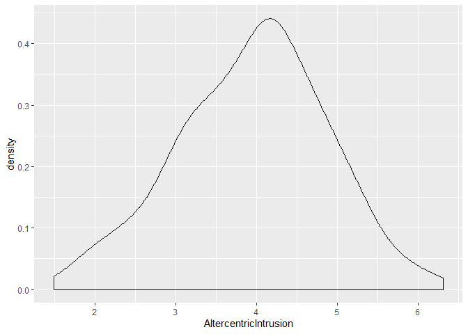

``` r
#Creating a zero intercept model of priors
m1_0_prior <- 
  brm(data = data, family = gaussian,
      AltercentricIntrusion ~ 0 + Diagnosis,
      prior = c(prior(normal(4,1), class = b), #specifying normally distributed beta prior with mean 4 and sd 1
                prior(normal(1,2), class = sigma) #specifying normally distributed sigma prior with mean 4 and sd 1
                ), 
                chains = 4,
                cores = 4,
                seed = 5,
      sample_prior = "only", #specifying only to sample from prior
      control = list(adapt_delta = 0.99))
```

    ## Compiling the C++ model

    ## Start sampling

``` r
# pp_check(m1_0_prior, nsamples =  100)

#Code for prior intercept model
# m1_1_prior <- 
#   brm(data = data, family = gaussian,
#       AltercentricIntrusion ~ 1 + Diagnosis,
#       prior = c(prior(normal(3, 1), class = Intercept),
#                 prior(normal(0,1.5), class = b),
#                 prior(normal(1,2), class = sigma)
#                 ), 
#                 chains = 4,
#                 cores = 4,
#                 seed = 5,
#       sample_prior = "only",
#       control = list(adapt_delta = 0.99))
# 
# 
# pp_check(m1_1_prior, nsamples =  100)


#Creating a zero intercept model of posteriors
m1_0_posterior <- 
  brm(data = data, family = gaussian,
      AltercentricIntrusion ~ 0 + Diagnosis,
      prior = c(prior(normal(4,1), class = b),
                prior(normal(1,2), class = sigma)
                ), 
                chains = 4,
                cores = 4,
                seed = 5,
      control = list(adapt_delta = 0.99))
```

    ## Compiling the C++ model

    ## recompiling to avoid crashing R session

    ## Start sampling

``` r
#Creating plots of prior and posterior predictive checks
plot1 <- pp_check(m1_0_prior, nsamples =  100)+
  ggtitle("Prior predictive check")
plot2 <- pp_check(m1_0_posterior, nsamples =  100)+
  ggtitle("Posterior predictive check")
gridExtra::grid.arrange(plot1, plot2, nrow = 1)
```

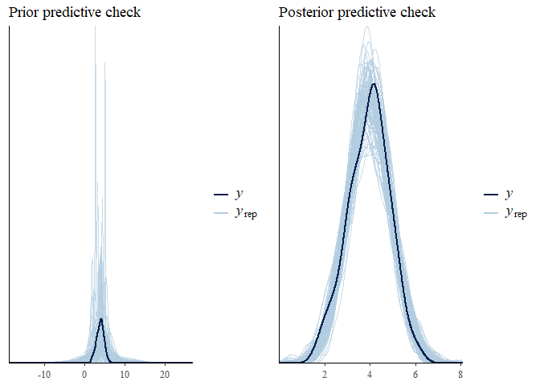

``` r
#printing model summary
print(m1_0_posterior, digits = 3)
```

    ##  Family: gaussian 
    ##   Links: mu = identity; sigma = identity 
    ## Formula: AltercentricIntrusion ~ 0 + Diagnosis 
    ##    Data: data (Number of observations: 300) 
    ## Samples: 4 chains, each with iter = 2000; warmup = 1000; thin = 1;
    ##          total post-warmup samples = 4000
    ## 
    ## Population-Level Effects: 
    ##            Estimate Est.Error l-95% CI u-95% CI  Rhat Bulk_ESS Tail_ESS
    ## Diagnosis0    3.861     0.063    3.739    3.981 1.000     3108     2404
    ## Diagnosis1    4.226     0.106    4.015    4.430 1.002     3139     2184
    ## 
    ## Family Specific Parameters: 
    ##       Estimate Est.Error l-95% CI u-95% CI  Rhat Bulk_ESS Tail_ESS
    ## sigma    0.914     0.039    0.841    0.992 1.002     2653     2317
    ## 
    ## Samples were drawn using sampling(NUTS). For each parameter, Bulk_ESS
    ## and Tail_ESS are effective sample size measures, and Rhat is the potential
    ## scale reduction factor on split chains (at convergence, Rhat = 1).

``` r
#plotting model summary
mcmc_plot(m1_0_posterior)
```

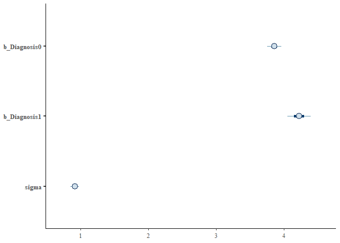

``` r
#Checking hypothesis that patient altercentric intrusion > controls
print(hypothesis(m1_0_posterior,
           "Diagnosis1 > Diagnosis0"), digits = 3)
```

    ## Hypothesis Tests for class b:
    ##                 Hypothesis Estimate Est.Error CI.Lower CI.Upper Evid.Ratio
    ## 1 (Diagnosis1)-(Dia... > 0    0.366     0.124    0.157     0.57    665.667
    ##   Post.Prob Star
    ## 1     0.998    *
    ## ---
    ## 'CI': 90%-CI for one-sided and 95%-CI for two-sided hypotheses.
    ## '*': For one-sided hypotheses, the posterior probability exceeds 95%;
    ## for two-sided hypotheses, the value tested against lies outside the 95%-CI.
    ## Posterior probabilities of point hypotheses assume equal prior probabilities.

``` r
#Plotting effects of diagnosis
conditional_effects(m1_0_posterior)
```

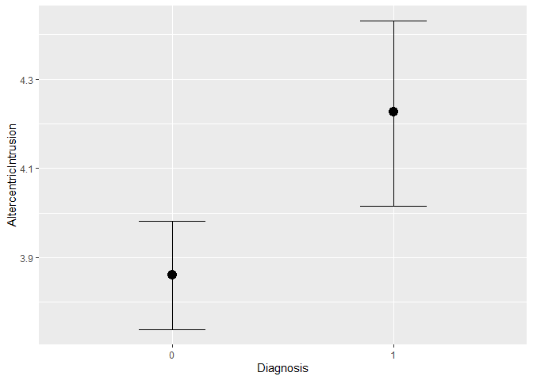

``` r
##Code for posterior intercept model
# m1_1_posterior <- 
#   brm(data = data, family = gaussian,
#       AltercentricIntrusion ~ 1 + Diagnosis,
#       prior = c(prior(normal(3, 1), class = Intercept),
#                 prior(normal(0,1.5), class = b),
#                 prior(normal(1,2), class = sigma)
#                 ), 
#                 chains = 4,
#                 cores = 4,
#                 seed = 5,
#       control = list(adapt_delta = 0.99))
# 
# 
# pp_check(m1_1_posterior, nsamples =  100)
# 
# print(m1_1_posterior, digits = 3)
# 
# mcmc_plot(m1_1_posterior)
# 
# 
# hypothesis(m1_1_posterior,
#            "Diagnosis1 > 0")
# 
# conditional_effects(m1_1_posterior)
# 
# plot(conditional_effects(m1_1_posterior), points=T)
```

Q1.2) Is altercentric intrusion related to specific symptoms *in the
patients*? Identify which of the symptoms could be relevant. Should you
include more than one symptom? Build models, priors, predictive checks.
Assess the evidence and report models and results, including plots.
Discuss whether the results make sense.

``` r
#Filtering data
patient_data <- data %>% filter(Diagnosis == 1)


###Constructing 3 univariate models


#Altercentric intrusion predicted by voicehearing

#checking characteristics of voice hearing
patient_data %>% 
  ggplot(aes(VoiceHearing))+
  geom_density()
```

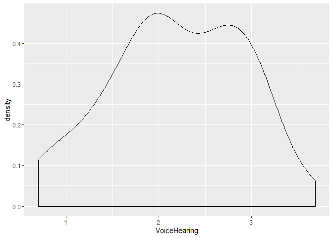

``` r
#Creating intercept model for priors
m2_VH_1_prior <- 
  brm(data = patient_data, family = gaussian,
      AltercentricIntrusion ~ 1 + VoiceHearing,
      prior = c(prior(normal(4, 1), class = Intercept),
                prior(normal(0,1), class = b),
                prior(normal(1,2), class = sigma)
                ), 
                chains = 4,
                cores = 4,
                seed = 5,
      sample_prior = "only",
      control = list(adapt_delta = 0.9))
```

    ## Compiling the C++ model

    ## Start sampling

``` r
pp_check(m2_VH_1_prior, nsamples = 100)
```

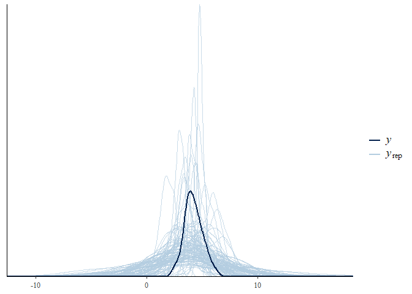

``` r
m2_VH_1_posterior <- 
  brm(data = patient_data, family = gaussian,
      AltercentricIntrusion ~ 1 + VoiceHearing,
      prior = c(prior(normal(4, 1), class = Intercept),
                prior(normal(0,1), class = b),
                prior(normal(1,2), class = sigma)
                ), 
                chains = 4,
                cores = 4,
                seed = 5,
      control = list(adapt_delta = 0.9))
```

    ## Compiling the C++ model

    ## recompiling to avoid crashing R session

    ## Start sampling

``` r
pp_check(m2_VH_1_posterior, nsamples = 100)
```

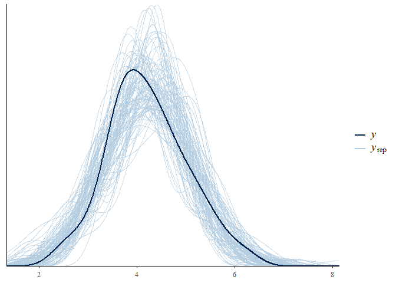

``` r
print(m2_VH_1_posterior, digits = 3)
```

    ##  Family: gaussian 
    ##   Links: mu = identity; sigma = identity 
    ## Formula: AltercentricIntrusion ~ 1 + VoiceHearing 
    ##    Data: patient_data (Number of observations: 75) 
    ## Samples: 4 chains, each with iter = 2000; warmup = 1000; thin = 1;
    ##          total post-warmup samples = 4000
    ## 
    ## Population-Level Effects: 
    ##              Estimate Est.Error l-95% CI u-95% CI  Rhat Bulk_ESS Tail_ESS
    ## Intercept       4.066     0.319    3.448    4.683 1.002     3918     2892
    ## VoiceHearing    0.072     0.136   -0.193    0.332 1.003     3788     2670
    ## 
    ## Family Specific Parameters: 
    ##       Estimate Est.Error l-95% CI u-95% CI  Rhat Bulk_ESS Tail_ESS
    ## sigma    0.835     0.070    0.711    0.986 1.000     3608     2781
    ## 
    ## Samples were drawn using sampling(NUTS). For each parameter, Bulk_ESS
    ## and Tail_ESS are effective sample size measures, and Rhat is the potential
    ## scale reduction factor on split chains (at convergence, Rhat = 1).

``` r
hypothesis(m2_VH_1_posterior, "VoiceHearing > 0")
```

    ## Hypothesis Tests for class b:
    ##           Hypothesis Estimate Est.Error CI.Lower CI.Upper Evid.Ratio
    ## 1 (VoiceHearing) > 0     0.07      0.14    -0.15      0.3       2.29
    ##   Post.Prob Star
    ## 1       0.7     
    ## ---
    ## 'CI': 90%-CI for one-sided and 95%-CI for two-sided hypotheses.
    ## '*': For one-sided hypotheses, the posterior probability exceeds 95%;
    ## for two-sided hypotheses, the value tested against lies outside the 95%-CI.
    ## Posterior probabilities of point hypotheses assume equal prior probabilities.

``` r
#Altercentric intrusion predicted by mind reading
patient_data %>% 
  ggplot(aes(MindReading))+
  geom_density()
```

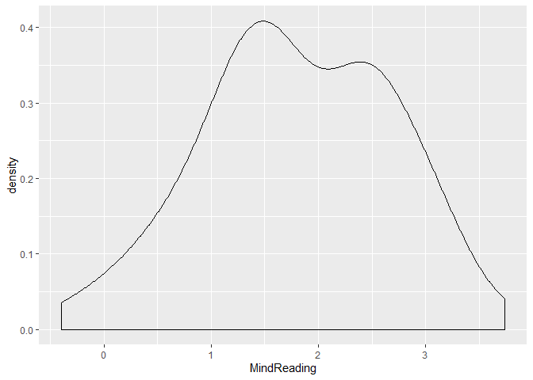

``` r
m2_MR_1_prior <- 
  brm(data = patient_data, family = gaussian,
      AltercentricIntrusion ~ 1 + MindReading,
      prior = c(prior(normal(4, 1), class = Intercept),
                prior(normal(0,1), class = b),
                prior(normal(1,2), class = sigma)
                ), 
                chains = 4,
                cores = 4,
                seed = 5,
      sample_prior = "only",
      control = list(adapt_delta = 0.9))
```

    ## Compiling the C++ model

    ## recompiling to avoid crashing R session

    ## Start sampling

``` r
pp_check(m2_MR_1_prior, nsamples = 100)
```

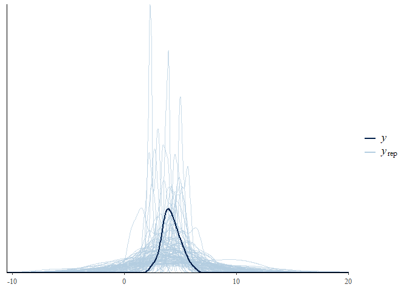

``` r
m2_MR_1_posterior <- 
  brm(data = patient_data, family = gaussian,
      AltercentricIntrusion ~ 1 + MindReading,
      prior = c(prior(normal(4, 1), class = Intercept),
                prior(normal(0,1), class = b),
                prior(normal(1,2), class = sigma)
                ), 
                chains = 4,
                cores = 4,
                seed = 5,
      control = list(adapt_delta = 0.9))
```

    ## Compiling the C++ model

    ## recompiling to avoid crashing R session

    ## Start sampling

``` r
pp_check(m2_MR_1_posterior, nsamples = 100)
```

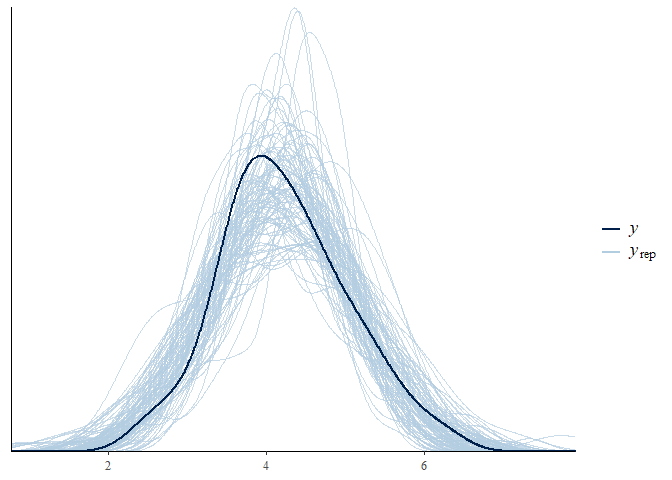

``` r
print(m2_MR_1_posterior, digits = 3)
```

    ##  Family: gaussian 
    ##   Links: mu = identity; sigma = identity 
    ## Formula: AltercentricIntrusion ~ 1 + MindReading 
    ##    Data: patient_data (Number of observations: 75) 
    ## Samples: 4 chains, each with iter = 2000; warmup = 1000; thin = 1;
    ##          total post-warmup samples = 4000
    ## 
    ## Population-Level Effects: 
    ##             Estimate Est.Error l-95% CI u-95% CI  Rhat Bulk_ESS Tail_ESS
    ## Intercept      4.083     0.226    3.634    4.525 1.002     3578     2577
    ## MindReading    0.078     0.112   -0.134    0.301 1.003     3217     2892
    ## 
    ## Family Specific Parameters: 
    ##       Estimate Est.Error l-95% CI u-95% CI  Rhat Bulk_ESS Tail_ESS
    ## sigma    0.833     0.070    0.710    0.983 1.000     3818     3104
    ## 
    ## Samples were drawn using sampling(NUTS). For each parameter, Bulk_ESS
    ## and Tail_ESS are effective sample size measures, and Rhat is the potential
    ## scale reduction factor on split chains (at convergence, Rhat = 1).

``` r
hypothesis(m2_MR_1_posterior, "MindReading > 0")
```

    ## Hypothesis Tests for class b:
    ##          Hypothesis Estimate Est.Error CI.Lower CI.Upper Evid.Ratio
    ## 1 (MindReading) > 0     0.08      0.11     -0.1     0.26       3.12
    ##   Post.Prob Star
    ## 1      0.76     
    ## ---
    ## 'CI': 90%-CI for one-sided and 95%-CI for two-sided hypotheses.
    ## '*': For one-sided hypotheses, the posterior probability exceeds 95%;
    ## for two-sided hypotheses, the value tested against lies outside the 95%-CI.
    ## Posterior probabilities of point hypotheses assume equal prior probabilities.

``` r
#Altercentric intrusion predicted by apathy

#Checking the characteristics of apathy variable
patient_data %>% 
  ggplot(aes(Apathy))+
  geom_density()
```

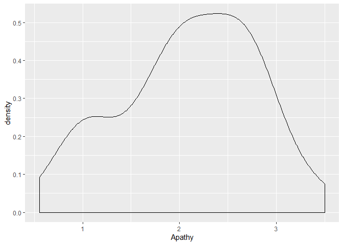

``` r
#Creating intercept model for priors
m2_AP_1_prior <- 
  brm(data = patient_data, family = gaussian,
      AltercentricIntrusion ~ 1 + Apathy,
      prior = c(prior(normal(4, 1), class = Intercept),
                prior(normal(0,1), class = b),#using the same beta prior for both predictors
                prior(normal(1,2), class = sigma)
                ), 
                chains = 4,
                cores = 4,
                seed = 5,
      sample_prior = "only",
      control = list(adapt_delta = 0.9))
```

    ## Compiling the C++ model

    ## recompiling to avoid crashing R session

    ## Start sampling

``` r
#Saving plot of prior predictive check
AP_pri_plot <- pp_check(m2_AP_1_prior, nsamples = 100)+
  ggtitle("Prior predictive check - Apathy")

#Creating intercept model for posteriors
m2_AP_1_posterior <- 
  brm(data = patient_data, family = gaussian,
      AltercentricIntrusion ~ 1 + Apathy,
      prior = c(prior(normal(4, 1), class = Intercept),
                prior(normal(0,1), class = b),#using the same beta prior for both predictors
                prior(normal(1,2), class = sigma)
                ), 
                chains = 4,
                cores = 4,
                seed = 5,
      control = list(adapt_delta = 0.9))
```

    ## Compiling the C++ model

    ## recompiling to avoid crashing R session

    ## Start sampling

``` r
#Saving plot of posterior predictive check
AP_pos_plot <- pp_check(m2_AP_1_posterior, nsamples = 100)+
  ggtitle("Posterior predictive check - Apathy")

#Plotting prior and posterior predictive checks
gridExtra::grid.arrange(AP_pri_plot, AP_pos_plot, ncol = 2)
```

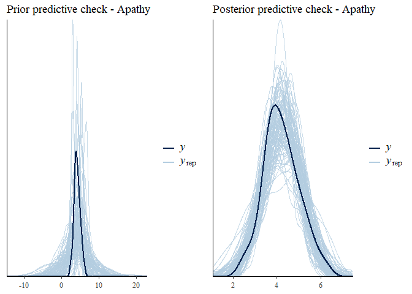

``` r
#printing model summary
print(m2_AP_1_posterior, digits = 3)
```

    ##  Family: gaussian 
    ##   Links: mu = identity; sigma = identity 
    ## Formula: AltercentricIntrusion ~ 1 + Apathy 
    ##    Data: patient_data (Number of observations: 75) 
    ## Samples: 4 chains, each with iter = 2000; warmup = 1000; thin = 1;
    ##          total post-warmup samples = 4000
    ## 
    ## Population-Level Effects: 
    ##           Estimate Est.Error l-95% CI u-95% CI  Rhat Bulk_ESS Tail_ESS
    ## Intercept    4.696     0.304    4.111    5.298 1.001     3605     2512
    ## Apathy      -0.225     0.136   -0.499    0.039 1.000     3827     2620
    ## 
    ## Family Specific Parameters: 
    ##       Estimate Est.Error l-95% CI u-95% CI  Rhat Bulk_ESS Tail_ESS
    ## sigma    0.820     0.068    0.697    0.962 1.002     3458     3131
    ## 
    ## Samples were drawn using sampling(NUTS). For each parameter, Bulk_ESS
    ## and Tail_ESS are effective sample size measures, and Rhat is the potential
    ## scale reduction factor on split chains (at convergence, Rhat = 1).

``` r
#plotting model summary
mcmc_plot(m2_AP_1_posterior)
```

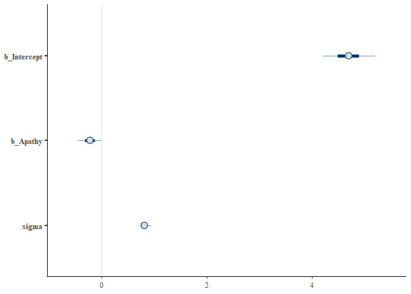

``` r
#testing the hypothesis of a positive effect of Apathy
print(hypothesis(m2_AP_1_posterior,
           "Apathy < 0"), digits = 3)
```

    ## Hypothesis Tests for class b:
    ##     Hypothesis Estimate Est.Error CI.Lower CI.Upper Evid.Ratio Post.Prob
    ## 1 (Apathy) < 0   -0.225     0.136   -0.448   -0.006     20.505     0.954
    ##   Star
    ## 1    *
    ## ---
    ## 'CI': 90%-CI for one-sided and 95%-CI for two-sided hypotheses.
    ## '*': For one-sided hypotheses, the posterior probability exceeds 95%;
    ## for two-sided hypotheses, the value tested against lies outside the 95%-CI.
    ## Posterior probabilities of point hypotheses assume equal prior probabilities.

``` r
#sampling predictions/fitted values from model
m2_AP_1_samples <- get_preds(m2_AP_1_posterior, patient_data)

#Plotting the effect of apathy on altercentric intrusion
m2_AP_1_samples %>% 
ggplot(aes(x = Apathy, y = Estimate)) +
  geom_smooth(aes(ymin = f_ll, ymax = f_ul),
              stat = "identity",
              fill = "firebrick", color = "firebrick4", alpha = 1/5, size = 1/4) +
  theme_bw() +
  theme(panel.grid = element_blank())+
  ylab("Altercentric intrusion")+
  ggtitle("Effect of apathy on altercentric intrusion in patients")
```

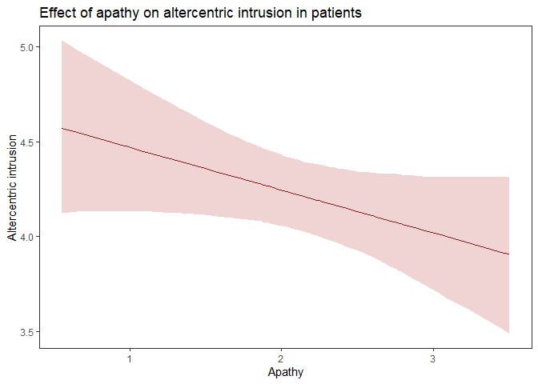

``` r
###Constructing multiple regression model

#check for correlation between variables
patient_data %>% 
  select(MindReading, VoiceHearing, Apathy) %>% 
  cor() %>% 
  round(digits = 4)
```

    ##              MindReading VoiceHearing  Apathy
    ## MindReading       1.0000      -0.3877 -0.4095
    ## VoiceHearing     -0.3877       1.0000 -0.1740
    ## Apathy           -0.4095      -0.1740  1.0000

``` r
#Altercentric intrusion predicted by voice hearing and mind reading

#Creating intercept model for priors
MR_VH_1_prior <- 
  brm(data = patient_data, family = gaussian,
      AltercentricIntrusion ~ 1 + MindReading + VoiceHearing,
      prior = c(prior(normal(4, 1), class = Intercept),
                prior(normal(0,1), class = b), #using the same beta prior for both predictors
                prior(normal(1,2), class = sigma)
                ), 
                chains = 4,
                cores = 4,
                seed = 5,
      sample_prior = "only",
      control = list(adapt_delta = 0.9))
```

    ## Compiling the C++ model

    ## recompiling to avoid crashing R session

    ## Start sampling

``` r
#Saving plot of prior predictive check
plot1 <- pp_check(MR_VH_1_prior, nsamples = 100)+
  ggtitle("Prior predictive check - Voice Hearing and Mind Reading")


#Creating intercept model for posteriors
MR_VH_1_posterior <- 
  brm(data = patient_data, family = gaussian,
      AltercentricIntrusion ~ 1 + MindReading + VoiceHearing,
      prior = c(prior(normal(4, 1), class = Intercept),
                prior(normal(0,1), class = b),#using the same beta prior for both predictors
                prior(normal(1,2), class = sigma)
                ), 
                chains = 4,
                cores = 4,
                seed = 5,
      control = list(adapt_delta = 0.9))
```

    ## Compiling the C++ model

    ## recompiling to avoid crashing R session

    ## Start sampling

``` r
#Saving plot of posterior predictive check
plot2 <- pp_check(MR_VH_1_posterior, nsamples = 100)+
  ggtitle("Posterior predictive check - Voice Hearing and Mind Reading")

#printing model summary
print(MR_VH_1_posterior, digits = 3)
```

    ##  Family: gaussian 
    ##   Links: mu = identity; sigma = identity 
    ## Formula: AltercentricIntrusion ~ 1 + MindReading + VoiceHearing 
    ##    Data: patient_data (Number of observations: 75) 
    ## Samples: 4 chains, each with iter = 2000; warmup = 1000; thin = 1;
    ##          total post-warmup samples = 4000
    ## 
    ## Population-Level Effects: 
    ##              Estimate Est.Error l-95% CI u-95% CI  Rhat Bulk_ESS Tail_ESS
    ## Intercept       3.727     0.457    2.837    4.643 1.002     3940     2873
    ## MindReading     0.120     0.120   -0.116    0.353 1.001     4089     2903
    ## VoiceHearing    0.128     0.145   -0.153    0.419 1.001     3946     3412
    ## 
    ## Family Specific Parameters: 
    ##       Estimate Est.Error l-95% CI u-95% CI  Rhat Bulk_ESS Tail_ESS
    ## sigma    0.836     0.070    0.714    0.986 1.003     3928     2667
    ## 
    ## Samples were drawn using sampling(NUTS). For each parameter, Bulk_ESS
    ## and Tail_ESS are effective sample size measures, and Rhat is the potential
    ## scale reduction factor on split chains (at convergence, Rhat = 1).

``` r
#plotting prior and posterior predictive checks
gridExtra::grid.arrange(plot1, plot2, ncol = 2)
```

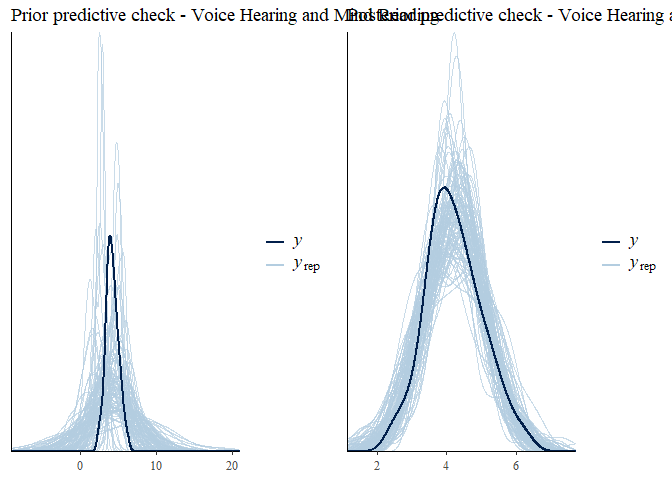

``` r
#plotting model summary
mcmc_plot(MR_VH_1_posterior)
```

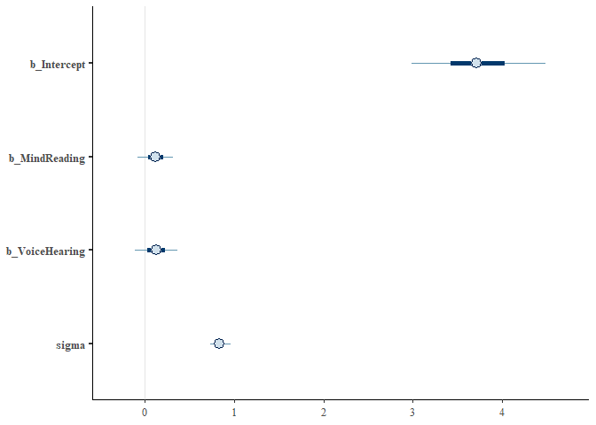

``` r
#checking the hypothesis that mindreading and voicehearing leads to increased altercentric intrusion
hypothesis(MR_VH_1_posterior,
           c("MindReading > 0", "VoiceHearing > 0"))
```

    ## Hypothesis Tests for class b:
    ##           Hypothesis Estimate Est.Error CI.Lower CI.Upper Evid.Ratio
    ## 1  (MindReading) > 0     0.12      0.12    -0.08     0.32       5.09
    ## 2 (VoiceHearing) > 0     0.13      0.14    -0.11     0.36       4.33
    ##   Post.Prob Star
    ## 1      0.84     
    ## 2      0.81     
    ## ---
    ## 'CI': 90%-CI for one-sided and 95%-CI for two-sided hypotheses.
    ## '*': For one-sided hypotheses, the posterior probability exceeds 95%;
    ## for two-sided hypotheses, the value tested against lies outside the 95%-CI.
    ## Posterior probabilities of point hypotheses assume equal prior probabilities.

``` r
#Altercentric intrusion predicted by voice hearing, mind reading and apathy

#Creating intercept model for priors
MR_VH_AP_1_prior <- 
  brm(data = patient_data, family = gaussian,
      AltercentricIntrusion ~ 1 + MindReading + VoiceHearing + Apathy,
      prior = c(prior(normal(4, 1), class = Intercept),
                prior(normal(0,1), class = b),#using the same beta prior for all predictors
                prior(normal(1,2), class = sigma)
                ), 
                chains = 4,
                cores = 4,
                seed = 5,
      sample_prior = "only",
      control = list(adapt_delta = 0.95))
```

    ## Compiling the C++ model

    ## recompiling to avoid crashing R session

    ## Start sampling

``` r
#Saving plot of prior predictive check
plot3 <- pp_check(MR_VH_AP_1_prior, nsamples = 100)+
  ggtitle("Prior predictive check - Voice Hearing + Mind Reading + Apathy")

#Creating intercept model for posteriors
MR_VH_AP_1_posterior <- 
  brm(data = patient_data, family = gaussian,
      AltercentricIntrusion ~ 1 + MindReading + VoiceHearing+ Apathy,
      prior = c(prior(normal(4, 1), class = Intercept),
                prior(normal(0,1), class = b),#using the same beta prior for all predictors
                prior(normal(1,2), class = sigma)
                ), 
                chains = 4,
                cores = 4,
                seed = 5,
      control = list(adapt_delta = 0.95))
```

    ## Compiling the C++ model

    ## recompiling to avoid crashing R session

    ## Start sampling

``` r
#Saving plot of posterior predictive check
plot4 <- pp_check(MR_VH_AP_1_posterior, nsamples = 100)+
  ggtitle("Posterior predictive check - Voice Hearing + Mind Reading + Apathy")

#Printing model summary
print(MR_VH_AP_1_posterior, digits = 3)
```

    ##  Family: gaussian 
    ##   Links: mu = identity; sigma = identity 
    ## Formula: AltercentricIntrusion ~ 1 + MindReading + VoiceHearing + Apathy 
    ##    Data: patient_data (Number of observations: 75) 
    ## Samples: 4 chains, each with iter = 2000; warmup = 1000; thin = 1;
    ##          total post-warmup samples = 4000
    ## 
    ## Population-Level Effects: 
    ##              Estimate Est.Error l-95% CI u-95% CI  Rhat Bulk_ESS Tail_ESS
    ## Intercept       4.445     0.750    2.959    5.913 1.001     1815     1832
    ## MindReading     0.034     0.135   -0.234    0.294 1.001     2315     2496
    ## VoiceHearing    0.058     0.154   -0.246    0.361 1.000     2517     2924
    ## Apathy         -0.196     0.162   -0.513    0.122 1.001     2583     2439
    ## 
    ## Family Specific Parameters: 
    ##       Estimate Est.Error l-95% CI u-95% CI  Rhat Bulk_ESS Tail_ESS
    ## sigma    0.830     0.070    0.704    0.980 1.000     4288     2939
    ## 
    ## Samples were drawn using sampling(NUTS). For each parameter, Bulk_ESS
    ## and Tail_ESS are effective sample size measures, and Rhat is the potential
    ## scale reduction factor on split chains (at convergence, Rhat = 1).

``` r
#Plotting prior and posterior predictive checks
gridExtra::grid.arrange(plot3, plot4, ncol = 2)
```

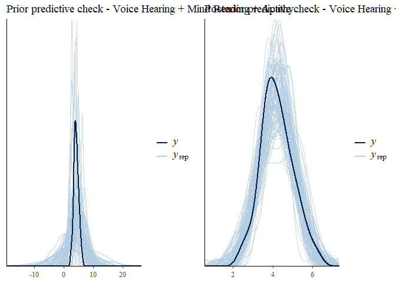

``` r
#Code for how to use information criteria
# m2_AP_1_posterior <- add_criterion(m2_AP_1_posterior, "waic")
# m2_MR_1_posterior <- add_criterion(m2_MR_1_posterior, "waic")
# m2_VH_1_posterior <- add_criterion(m2_VH_1_posterior, "waic")
# MR_VH_1_posterior <- add_criterion(MR_VH_1_posterior, "waic")
# 
# w <- loo_compare(m2_AP_1_posterior, m2_MR_1_posterior, m2_VH_1_posterior, MR_VH_1_posterior, criterion = "waic")
# print(w, simplify = F)
```

Second part
-----------

Q2.1) However, we know that the diagnosis is based on symptom
assessment: if the overall sum of symptoms is severe enough, the
participant gets a diagnosis. In other words, by selecting the patients,
and including the symptoms in the model we might have inadvertently
introduced an issue in our inference. Do try to draw a causal graph
(Directed Acyclical Graph) of the variables and compare it with the
types of causal graphs presented in the slides. Discuss which biases you
might have introduced.

Q2.2.) Redesign your analysis following the graph and report how the
results change

``` r
#We're now back to using the entire dataset again as to prevent collider bias

#Altercentric intrusion predicted by apathy

#Checking the characteristics of Apathy
data %>% 
  ggplot(aes(Apathy))+
  geom_density()
```

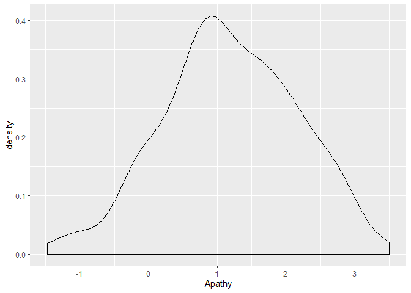

``` r
#Creating intercept model for priors
m3_AP_1_prior <- 
  brm(data = data, family = gaussian,
      AltercentricIntrusion ~ 1 + Apathy,
      prior = c(prior(normal(4, 1), class = Intercept),
                prior(normal(0,0.5), class = b), #Using more sceptical prior considering previous analyses - to be used from here on
                prior(normal(1,2), class = sigma)
                ), 
                chains = 4,
                cores = 4,
                seed = 5,
      sample_prior = "only",
      control = list(adapt_delta = 0.9))
```

    ## Compiling the C++ model

    ## Start sampling

``` r
#Saving plot of prior predictive check
plot5 <- pp_check(m3_AP_1_prior, nsamples = 100)+
  ggtitle("Prior Predictive Check - Apathy")

#Creating intercept model for posteriors
m3_AP_1_posterior <- 
  brm(data = data, family = gaussian,
      AltercentricIntrusion ~ 1 + Apathy,
      prior = c(prior(normal(4, 1), class = Intercept),
                prior(normal(0,0.5), class = b), 
                prior(normal(1,2), class = sigma)
                ), 
                chains = 4,
                cores = 4,
                seed = 5,
      control = list(adapt_delta = 0.9))
```

    ## Compiling the C++ model

    ## recompiling to avoid crashing R session

    ## Start sampling

``` r
#Saving plot of posterior predictive check
plot6 <- pp_check(m3_AP_1_posterior, nsamples = 100)+
  ggtitle("Posterior Predictive Check - Apathy")


#Plotting prior and posterior predictive checks
gridExtra::grid.arrange(plot5, plot6, ncol = 2)
```

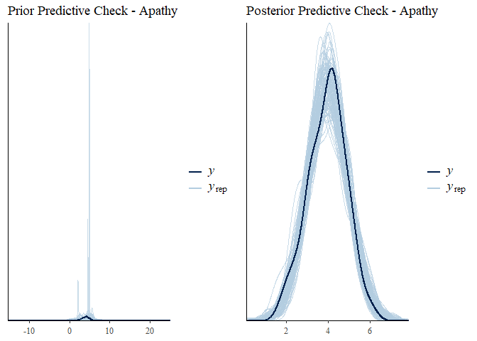

``` r
#Printing model summary
print(m3_AP_1_posterior, digits = 3)
```

    ##  Family: gaussian 
    ##   Links: mu = identity; sigma = identity 
    ## Formula: AltercentricIntrusion ~ 1 + Apathy 
    ##    Data: data (Number of observations: 300) 
    ## Samples: 4 chains, each with iter = 2000; warmup = 1000; thin = 1;
    ##          total post-warmup samples = 4000
    ## 
    ## Population-Level Effects: 
    ##           Estimate Est.Error l-95% CI u-95% CI  Rhat Bulk_ESS Tail_ESS
    ## Intercept    3.853     0.085    3.685    4.015 1.000     3219     2792
    ## Apathy       0.083     0.056   -0.029    0.191 1.002     3394     2715
    ## 
    ## Family Specific Parameters: 
    ##       Estimate Est.Error l-95% CI u-95% CI  Rhat Bulk_ESS Tail_ESS
    ## sigma    0.925     0.038    0.854    1.003 1.000     3707     2773
    ## 
    ## Samples were drawn using sampling(NUTS). For each parameter, Bulk_ESS
    ## and Tail_ESS are effective sample size measures, and Rhat is the potential
    ## scale reduction factor on split chains (at convergence, Rhat = 1).

``` r
#Testing the hypothesis that the effect of Apathy is still negative
hypothesis(m3_AP_1_posterior, "Apathy > 0")
```

    ## Hypothesis Tests for class b:
    ##     Hypothesis Estimate Est.Error CI.Lower CI.Upper Evid.Ratio Post.Prob
    ## 1 (Apathy) > 0     0.08      0.06    -0.01     0.17      12.51      0.93
    ##   Star
    ## 1     
    ## ---
    ## 'CI': 90%-CI for one-sided and 95%-CI for two-sided hypotheses.
    ## '*': For one-sided hypotheses, the posterior probability exceeds 95%;
    ## for two-sided hypotheses, the value tested against lies outside the 95%-CI.
    ## Posterior probabilities of point hypotheses assume equal prior probabilities.

``` r
#Altercentric intrusion predicted by voice hearing, mind reading and apathy

#Checking characteristics of Voice hearing
data %>% 
  ggplot(aes(VoiceHearing))+
  geom_density()
```

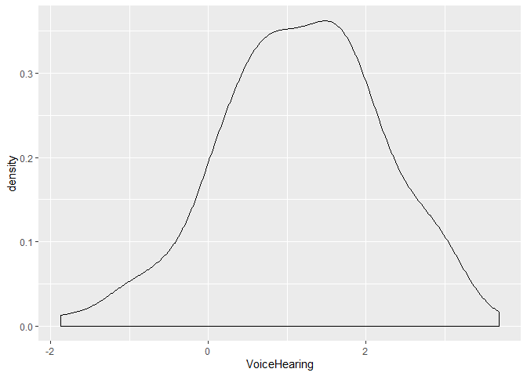

``` r
#Checking characteristics of Mind reading
data %>% 
  ggplot(aes(MindReading))+
  geom_density()
```

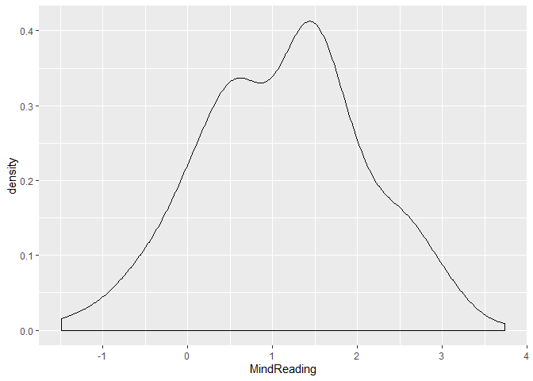

``` r
#Creating intercept model for prior
m3_full_1_prior <- 
  brm(data = data, family = gaussian,
      AltercentricIntrusion ~ 1 + Apathy + VoiceHearing + MindReading,
      prior = c(prior(normal(4, 1), class = Intercept),
                prior(normal(0,0.5), class = b),
                prior(normal(1,2), class = sigma)
                ), 
                chains = 4,
                cores = 4,
                seed = 5,
      sample_prior = "only",
      control = list(adapt_delta = 0.9))
```

    ## Compiling the C++ model

    ## recompiling to avoid crashing R session

    ## Start sampling

``` r
#Saving plot of prior predictive check
plot7 <- pp_check(m3_full_1_prior, nsamples = 100)+
  ggtitle("Prior Predictive Plot - Full")

#Creating intercept model for posteriors
m3_full_1_posterior <- 
  brm(data = data, family = gaussian,
      AltercentricIntrusion ~ 1 + Apathy + VoiceHearing + MindReading,
      prior = c(prior(normal(4, 1), class = Intercept),
                prior(normal(0,0.5), class = b), 
                prior(normal(1,2), class = sigma)
                ), 
                chains = 4,
                cores = 4,
                seed = 5,
      control = list(adapt_delta = 0.9))
```

    ## Compiling the C++ model

    ## recompiling to avoid crashing R session

    ## Start sampling

``` r
#Saving plot of posterior predictive check
plot8 <- pp_check(m3_full_1_posterior, nsamples = 100)+
  ggtitle("Posterior Predictive Plot - Full")

#Plotting prior and posterior predictive checks
gridExtra::grid.arrange(plot7, plot8, ncol = 2)
```

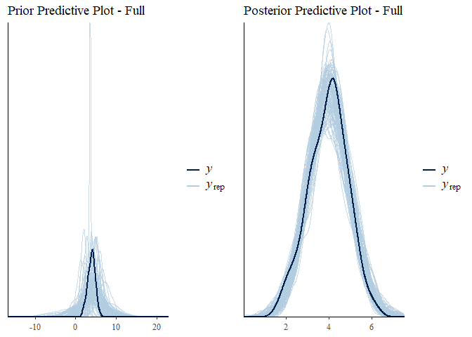

``` r
#printing model summary
print(m3_full_1_posterior, digits = 3)
```

    ##  Family: gaussian 
    ##   Links: mu = identity; sigma = identity 
    ## Formula: AltercentricIntrusion ~ 1 + Apathy + VoiceHearing + MindReading 
    ##    Data: data (Number of observations: 300) 
    ## Samples: 4 chains, each with iter = 2000; warmup = 1000; thin = 1;
    ##          total post-warmup samples = 4000
    ## 
    ## Population-Level Effects: 
    ##              Estimate Est.Error l-95% CI u-95% CI  Rhat Bulk_ESS Tail_ESS
    ## Intercept       3.583     0.103    3.384    3.782 1.002     5652     3191
    ## Apathy          0.015     0.056   -0.094    0.123 1.000     5465     2986
    ## VoiceHearing    0.148     0.053    0.044    0.252 1.000     5634     3159
    ## MindReading     0.157     0.053    0.052    0.260 1.000     5158     2642
    ## 
    ## Family Specific Parameters: 
    ##       Estimate Est.Error l-95% CI u-95% CI  Rhat Bulk_ESS Tail_ESS
    ## sigma    0.901     0.037    0.832    0.979 1.001     5859     2756
    ## 
    ## Samples were drawn using sampling(NUTS). For each parameter, Bulk_ESS
    ## and Tail_ESS are effective sample size measures, and Rhat is the potential
    ## scale reduction factor on split chains (at convergence, Rhat = 1).

``` r
#Testing the hypotheses:
#The effect of mind reading is positive
#The effect of voice hearing is positive
##The effect of apathy is positive
hypothesis(m3_full_1_posterior,
           c("MindReading > 0", "VoiceHearing > 0", "Apathy > 0"))
```

    ## Hypothesis Tests for class b:
    ##           Hypothesis Estimate Est.Error CI.Lower CI.Upper Evid.Ratio
    ## 1  (MindReading) > 0     0.16      0.05     0.07     0.24     499.00
    ## 2 (VoiceHearing) > 0     0.15      0.05     0.06     0.24     306.69
    ## 3       (Apathy) > 0     0.01      0.06    -0.08     0.11       1.49
    ##   Post.Prob Star
    ## 1       1.0    *
    ## 2       1.0    *
    ## 3       0.6     
    ## ---
    ## 'CI': 90%-CI for one-sided and 95%-CI for two-sided hypotheses.
    ## '*': For one-sided hypotheses, the posterior probability exceeds 95%;
    ## for two-sided hypotheses, the value tested against lies outside the 95%-CI.
    ## Posterior probabilities of point hypotheses assume equal prior probabilities.

``` r
#Since Apathy isn't credible anymore,
#we fit a multiple regression with only mind reading and voice hearing

#Creating intercept model for prior
m3_VH_MR_1_prior <- 
  brm(data = data, family = gaussian,
      AltercentricIntrusion ~ 1 + VoiceHearing + MindReading,
      prior = c(prior(normal(4, 1), class = Intercept),
                prior(normal(0,0.5), class = b),
                prior(normal(1,2), class = sigma)
                ), 
                chains = 4,
                cores = 4,
                seed = 5,
      sample_prior = "only",
      control = list(adapt_delta = 0.9))
```

    ## Compiling the C++ model

    ## recompiling to avoid crashing R session

    ## Start sampling

``` r
#Saving plot of prior predictive check
plot7 <- pp_check(m3_VH_MR_1_prior, nsamples = 100)+
  ggtitle("Prior Predictive Plot - Full")

#Creating intercept model for posterior
m3_VH_MR_1_posterior <- 
  brm(data = data, family = gaussian,
      AltercentricIntrusion ~ 1 + VoiceHearing + MindReading,
      prior = c(prior(normal(4, 1), class = Intercept),
                prior(normal(0,0.5), class = b),
                prior(normal(1,2), class = sigma)
                ), 
                chains = 4,
                cores = 4,
                seed = 5,
      control = list(adapt_delta = 0.9))
```

    ## Compiling the C++ model

    ## recompiling to avoid crashing R session

    ## Start sampling

``` r
#Saving plot of posterior predictive check
plot8 <- pp_check(m3_VH_MR_1_posterior, nsamples = 100)+
  ggtitle("Posterior Predictive Plot - Full")


#Plotting prior and posterior predictive checks
gridExtra::grid.arrange(plot7, plot8, ncol = 2)
```

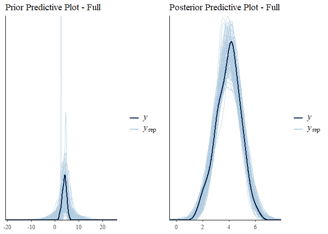

``` r
#Printing model summary
print(m3_VH_MR_1_posterior, digits = 3)
```

    ##  Family: gaussian 
    ##   Links: mu = identity; sigma = identity 
    ## Formula: AltercentricIntrusion ~ 1 + VoiceHearing + MindReading 
    ##    Data: data (Number of observations: 300) 
    ## Samples: 4 chains, each with iter = 2000; warmup = 1000; thin = 1;
    ##          total post-warmup samples = 4000
    ## 
    ## Population-Level Effects: 
    ##              Estimate Est.Error l-95% CI u-95% CI  Rhat Bulk_ESS Tail_ESS
    ## Intercept       3.596     0.095    3.413    3.780 1.002     5270     3087
    ## VoiceHearing    0.151     0.050    0.054    0.248 1.000     5455     2463
    ## MindReading     0.158     0.055    0.052    0.263 1.000     4419     3070
    ## 
    ## Family Specific Parameters: 
    ##       Estimate Est.Error l-95% CI u-95% CI  Rhat Bulk_ESS Tail_ESS
    ## sigma    0.899     0.037    0.830    0.974 1.001     4825     2808
    ## 
    ## Samples were drawn using sampling(NUTS). For each parameter, Bulk_ESS
    ## and Tail_ESS are effective sample size measures, and Rhat is the potential
    ## scale reduction factor on split chains (at convergence, Rhat = 1).

``` r
#Testing the hypotheses:
#The effect of mind reading is positive
#The effect of voice hearing is positive
hypothesis(m3_VH_MR_1_posterior,
           c("MindReading > 0", "VoiceHearing > 0"))
```

    ## Hypothesis Tests for class b:
    ##           Hypothesis Estimate Est.Error CI.Lower CI.Upper Evid.Ratio
    ## 1  (MindReading) > 0     0.16      0.05     0.07     0.25     443.44
    ## 2 (VoiceHearing) > 0     0.15      0.05     0.07     0.23    3999.00
    ##   Post.Prob Star
    ## 1         1    *
    ## 2         1    *
    ## ---
    ## 'CI': 90%-CI for one-sided and 95%-CI for two-sided hypotheses.
    ## '*': For one-sided hypotheses, the posterior probability exceeds 95%;
    ## for two-sided hypotheses, the value tested against lies outside the 95%-CI.
    ## Posterior probabilities of point hypotheses assume equal prior probabilities.

``` r
#Producing counterfactual plots to show the effects of the predictors

#creating new data for the model to predict
nd <- 
  tibble(VoiceHearing          = seq(from = -2, to = 4, length.out = 300), #300 voice hearing observations from -2 to 4
         MindReading = mean(data$MindReading)) #fixing mind reading to be the mean of original mind reading (could be set to any value)


fitted(m3_VH_MR_1_posterior, newdata = nd) %>% #fitting counterfactual data
  as_tibble() %>% 
  rename(f_ll = Q2.5,
         f_ul = Q97.5) %>% 
  bind_cols(
    predict(m3_VH_MR_1_posterior, newdata = nd) %>% #predictions including sigma
      as_tibble() %>% 
      transmute(p_ll = Q2.5,
                p_ul = Q97.5),
    nd) %>% 
  
  #plotting regression using geom smooth 
  ggplot(aes(x = VoiceHearing, y = Estimate)) +
  geom_smooth(aes(ymin = f_ll, ymax = f_ul),
              stat = "identity",
              fill = "firebrick", color = "firebrick4", alpha = 1/5, size = 1/4) +
  coord_cartesian(xlim = range(data$VoiceHearing),
                  ylim = c(0, 7)) +
  labs(subtitle = "Counterfactual plot for which\nMindReading = mean of MindReading",
       y = "Altercentric Intrusion") +
  theme_bw() +
  theme(panel.grid = element_blank()) 
```

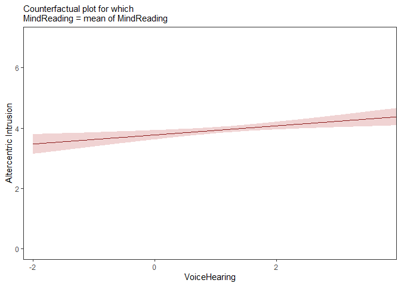

``` r
nd <- 
  tibble(MindReading          = seq(from = -2, to = 4, length.out = 300), #300 mind reading observations from -2 to 4
         VoiceHearing = 0) #fixing voicehaering to be 0 (could be set to any value)


fitted(m3_VH_MR_1_posterior, newdata = nd) %>% #fitting counterfactual data
  as_tibble() %>% 
  rename(f_ll = Q2.5,
         f_ul = Q97.5) %>% 
  bind_cols(
    predict(m3_VH_MR_1_posterior, newdata = nd) %>% 
      as_tibble() %>% 
      transmute(p_ll = Q2.5,
                p_ul = Q97.5),
    nd) %>% 
  
  #plotting regression using geom smooth
  ggplot(aes(x = MindReading, y = Estimate)) +
  geom_smooth(aes(ymin = f_ll, ymax = f_ul),
              stat = "identity",
              fill = "firebrick", color = "firebrick4", alpha = 1/5, size = 1/4) +
  coord_cartesian(xlim = range(data$MindReading),
                  ylim = c(0, 7)) +
  labs(subtitle = "Counterfactual plot for which\nVoiceHearing = 0",
       y = "Altercentric Intrusion") +
  theme_bw() +
  theme(panel.grid = element_blank()) 
```

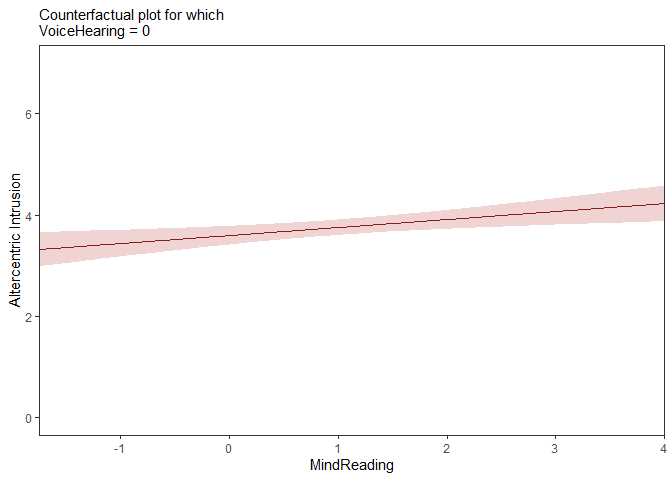

Third part
----------

These issues are very difficult to think through, and not knowing the
causal mechanisms generating the data in advance makes our inferences
even more unreliable. To explore these issues, I recommend using
simulations. In other words, defining a “true” model, generating data
from it and assessing what different analyses would lead you to infer
(and therefore which biases they might introduce). You can find the code
I used to simulate your data below.

Q3.1) Look through the code and identify whether the results you have
match the underlying truth. Discuss what you have learned.

Q3.2) OPTIONAL: is this a general pattern? Try varying the parameters
(e.g. correlation values) and assess whether the new dataset(s) leads to
the same biases in your analysis.

``` r
pacman::p_load(MASS, tidyverse, psych)
```

    ## Installing package into 'C:/Users/jacda/OneDrive/Dokumenter/R/win-library/3.6'
    ## (as 'lib' is unspecified)

    ## also installing the dependency 'mnormt'

    ## Warning: unable to access index for repository http://www.stats.ox.ac.uk/pub/RWin/bin/windows/contrib/3.6:
    ##   kan ikke åbne adresse 'http://www.stats.ox.ac.uk/pub/RWin/bin/windows/contrib/3.6/PACKAGES'

    ## package 'mnormt' successfully unpacked and MD5 sums checked
    ## package 'psych' successfully unpacked and MD5 sums checked
    ## 
    ## The downloaded binary packages are in
    ##  C:\Users\jacda\AppData\Local\Temp\RtmpW29alZ\downloaded_packages

    ## 
    ## psych installed

    ## Warning: package 'psych' was built under R version 3.6.3

``` r
seed <- 1981 # Defining a seed so the results are always the same
n <- 300 # Defining the amount of participants

SymptomCorr <- .2 # Defining the correlation of symptoms (as they tend to co-occur)
EffectCorrRel <- .2 # Defining the correlation between relevant symptoms and effect (Some symptoms are positively correlated with the effect)
EffectCorrIrrel <- 0 # Defining the correlation between irrelevant symptoms and effect (none)

# Creating the variance-covariance matrix for the variables we want to generate (3 symptoms, 1 effect)
Sigma <- matrix(data=c(1,SymptomCorr,SymptomCorr,EffectCorrRel,
                       SymptomCorr,1,SymptomCorr,EffectCorrRel,
                       SymptomCorr,SymptomCorr,1,EffectCorrIrrel,
                       EffectCorrRel,EffectCorrRel,EffectCorrIrrel,1),
                       nrow=4,ncol=4)

## Generate data from a multivariate (mvr) normal (n) distribution
d <- mvrnorm(n = n, # number of participant
        mu = c(1.2, 1.2, 1.2, 4), # mean of each variable
        Sigma) # variance co-variance matrix

# Giving meaningful names to variables and add ID
d <- data.frame(
  VoiceHearing = d[,1], 
  MindReading =  d[,2],
  Apathy =  d[,3], 
  AltercentricIntrusion = d[,4],
  ID = seq(nrow(d)))

# Assessing whether the participant has schizophrenia (high enough sum of symptoms)
# Here we choose participants scoring above 75% percentile (the most severe ones)
d$Diagnosis <- 0
d$Diagnosis[(d$VoiceHearing + d$MindReading + d$Apathy) > 
              quantile(d$VoiceHearing + d$MindReading + d$Apathy, .75)] <-1

## Plotting the relation between variables in schizophrenia
d1 <- d %>% subset(Diagnosis==1) %>% dplyr::select(-Diagnosis, -ID)
pairs.panels(d1)
```


``` r
## Plotting the relation between variables all participants
pairs.panels(dplyr::select(d,-Diagnosis, -ID))
```

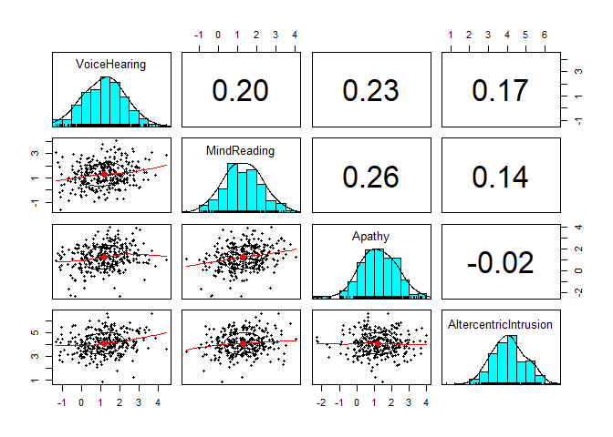

``` r
# write_csv(d, "data/Ass3.csv")
```
